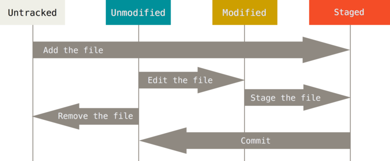
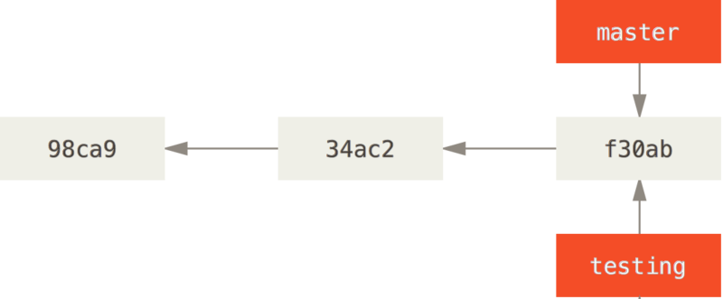
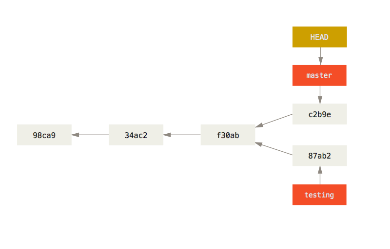
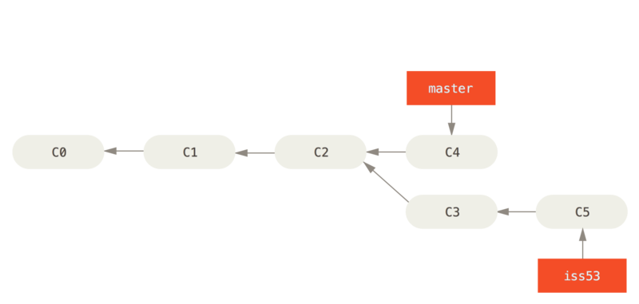
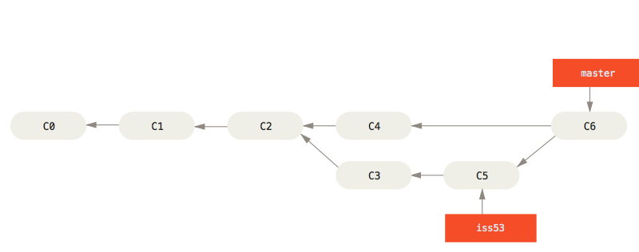

## ZeroToGit : 基于win的Git自学笔记
---
### 宇宙级本项目内容免责申明
---
* 本文部分内容源自AI
* 本文内容面向零基础小白，为不会使用Git的小伙伴入门学习使用

### 目录
---
* [Git简介](#一、Git简介)
	- [Git是什么？](#1. Git是什么?)
	- [为什么用Git？](#2. 为什么用Git?)
* [Git的安装与配置](#二、Git的安装与配置)
	- [Git的安装](#1. Git的安装)
	- [Git的初始配置](#2. Git的初始配置)
* [Git的基本使用](#三、Git的基本使用)
	- [Git Repository 是什么](#1. Git Repository 是什么?)
	- [创建一个仓库](#2. 创建一个仓库)
	- [Git中文件的四种状态](#3. Git中文件的四种状态)
* [Git分支](#四、Git分支)
	- [分支的创建](#1. 分支的创建)
	- [分支的合并](#2. 分支的合并)
* [Git的一些其他操作](#五、 Git的一些其他操作 )
	- [特殊指令](#1. 特殊指令)
	- [ `.gitignore`文件](# 2. `.gitignore`文件)
	- [Revert和Reset](# 3. Revert和Reset)
* [Remote远程](# 六、Remote远程)
### 一、Git简介
---
#### 1. Git是什么?
Git 是一个分布式版本控制系统，由 Linus Torvalds 于 2005 年创建，用于高效追踪代码的变更历史。它让每位开发者在本地保存项目的完整副本和全部历史记录，支持分支管理、代码合并与冲突解决，使团队能够并行开发、随时回退到任意版本，是现代软件开发中不可或缺的协作工具。
#### 2. 为什么用Git?
Git之所以成为行业标准，关键在于其**分布式架构**——每个开发者本地都保有完整的代码仓库与全部历史，无需联网即可提交、分支和回滚，既避免了集中式系统（如 SVN）的单点故障风险，又通过轻量级分支设计让并行开发变得极为高效。
### 二、Git的安装与配置
---
#### 1. Git的安装
* **访问官网下载页面**
	a. 打开浏览器，访问 [Git 官方 Windows 下载页面](https://git-scm.com/install/windows)。
	b. 页面会自动推荐适合你系统的最新版本（当前为 **2.55.0**）。
	**Windows x64用户**：直接点击页面顶部的 **"Click here to download"**，下载**x64**版本的安装程序。
* **运行安装程序**
	双击下载的 `.exe` 文件，启动安装向导。
* **按向导完成安装**
	一路点击 **Next** 即可使用默认配置完成安装。关键选项说明：
> 这里适合没有接触过Git的小白，一些特殊选项功能如下

   | **Select Components**| 保持默认勾选即可。|
   | -------------------------- | ----------------------|
   | **Choosing the default editor used by Git**| 选择你习惯的文本编辑器（默认 Vim，可改为 VS Code、Notepad++ 等）。 |
   | **Adjusting the name of the initial branch in new repositories** | 建议保持默认或选择 `main`。|
   | **Adjusting your PATH environment** | 推荐选择 **"Git from the command line and also from 3rd-party software"**，以便在任意终端使用 Git。|

* **验证安装**
  打开 **PowerShell** 或 **CMD**，输入以下命令：
```powershell
  git --version //--version 查看git的版本
```
  当**Powershell**或**CMD**中显示Git的相关版本信息及为安装成功，就像下面这样(意思是git版本为Windows的2.49.0):
```powershell
  git version 2.49.0.windows.1
```
#### 2. Git的初始配置
**a. 初始配置**
初次使用时，要为git配置几项用户初始参数，在Powershell或CMD中使用以下指令 :

```powershell
$git config --global user.name "unimilk"
$git config --global user.email unimilk@example.com
$git config --global core.editor vscode
//git --- 指令调用git 
//config --- 指令对日志进行操作
//--global --- 用户级操作
```
> * name:出现在commit的元数据当中，协作时方便认识你
> * email:个人的邮箱联系方式，与Github无关
> * editor:git提交时默认打开的编辑器
> 配置这些信息，方便当你在Github等平台公开repo后用户通过他们联系你

**b. Git的三份配置文件**
Git有三份配置文件，其中包含刚刚在Powershell或CMD中配置的信息，分别分为三个层级，分别是System，global和local

| 层级          | 作用范围      | 优先级 |
|:-----------:|:---------:|:---:|
| System(系统级) | 整台机器的所有用户 | 低   |
| Global(用户级) | 当前用户      | 中   |
| local(项目级)  | 当前仓库      | 高   |
> 覆盖规则: local > global > system

* 他们在哪里
  - System(系统级)
    ```
    C:\Program Files\Git\etc\gitconfig 或
    C:\ProgramData\Git\config (取决于安装模式)
    ```
  - Global(用户级)
    ```
    C:\Users\<你的用户名字>\.gitconfig
    ```
  - Local(项目级)
    ```
    你的项目目录\.git\config
    ```
* 查看相关配置信息
  - 在Powershell或CMD中输入以下指令查看配置信息
    ```
    git config --list // --list --- 列表
    ```

### 三、Git的基本使用
---
#### 1. Git Repository 是什么?
这是一个存储项目中所有**commit记录**、**分支结构**的仓库，并不只是一存放文件的容器，简称Repo
> * Github上每一个项目都有一个git Repository
> * 要用git管理项目，就必须首先创造一个Repo

#### 2. 创建一个仓库
**工作目录是什么?**
在开始之前你要知道什么是**工作目录**:工作目录是一个文件夹,它可以存放多个项目,也可以存放单个项目。
> 举个例子:
> *单项目文件夹*是指，你在桌面新建文件夹my-blog，里面只有一套博客代码，整个文件夹就服务这一个项目。
> *多项目文件夹*是指，你建了一个my-workspace文件夹，里面同时放了博客前端、后台接口和工具脚本，三个子项目共存于一个工作目录。

​	**a. 准备一个工作目录**
​	以本项目为例，本项目将文件夹`ZeroToGit`视为工作目录，工作目录下有一个**Markdown**文件,目录结构如下所示:

```
ZeroToGit
└── ZeroToGit.md
```
​	**b. 初始化git仓库**
​	在项目工作目录下，执行以下程序以创建仓库:

```powershell
	$git init  //init --- 初始化git
```
指令运行结束后，工作目录下生成`.git`文件夹 = git仓库
> * 在Windows操作系统中，右键文件夹空白位置，选择选项"在终端中打开"，在弹出的终端中可以可以输入指令处理该目录内的文件
> * `.git`是一个隐藏文件夹，这里放一个显示隐藏文件的[教程链接](https://blog.csdn.net/I_feige/article/details/130890085)，来自CSDN

当完成以上初始化后目录结构变化如下
```
ZeroToGit
├── .git
└── ZeroToGit.md
```
**c. 首次提交**
首次提交需要在工作目录使用两个指令，以本项目为例，指令如下:
```
$git add ZeroToGit.md			//add 将ZeroToGit.md添加到下一次提交当中
$git commit -m "first commit"	//commit 作一次提交 
					//-m message译为信息 意思是本次提交设置"first commit"为备注信息
```
完成以上步骤后即完成了**首次提交**，通过`log`指令可以查询提交日志，指令如下:
`$git log`
#### 3. Git中文件的四种状态
现在我们手上有了一个包含真实项目的**Git仓库**。接下来，我们要对这些文件做些修改和更新，在完成了一个阶段的更新目标之后，提交本次更新到仓库。
为了方便处理仓库中的文件，Git认定仓库中的文件的分别处于**四种状态**:
* 其中,在git中的文件被分为两大基本状态，分别是**Untracked(未跟踪状态)**和**Tracked(已追踪状态)**。
	- **已跟踪状态**是指那些被纳入了版本控制的文件所处的状态:在上一次快照中有它们的记录，在工作一段时间后，它们根据自身的**状态**分为三种:
		- **Staged(已放入暂存区)**:文件被`add`后进入已放入缓存区状态，或者等待修改和`commit`
		- **Unmodified(未修改)**:文件被`commit`后进入未修改状态
		- **Modified(已修改)**:文件修改后进入已修改状态，该状态下
	- **未跟踪状态**:工作目录中除已跟踪文件以外的所有其它文件都属于未跟踪文件，它们既不存在于上次快照的记录中，也没有放入暂存区。
	四种状态的关系示意图如下:
	

### 四、Git分支
---
#### 1. 分支的创建
**分支简介**
* 为了真正理解 Git 处理分支的方式，我们需要了解一下 Git 是如何保存数据的。Git 保存的不是文件的变化或者差异，而是一系列不同时刻的文件快照。

* 在进行提交操作时，Git 会保存一个提交对象，该提交对象会包含一个指向暂存内容快照的指针。 该提交对象还包含了作者的姓名和邮箱、提交时输入的信息以及指向它的父对象的指针。首次提交产生的提交对象没有父对象，普通提交操作产生的提交对象有一个父对象，而由多个分支合并产生的提交对象有多个父对象。

**创建分支**
* Git创建一个新的分支，本质上是创建一个可以移动的新指针。例如创建一个名为`testing`的分支
`$git branch testing`
实际效果图如下:


* Git是怎么知道当前在哪一个分支上呢? 原来是分支上有一个名为`HEAD`的特殊指针，它指向现在所在位置

**分支切换**
* 切换到一个已存在的分支，要使用`checkout`指令，文件内容和形式回退回到master所指向的镜像
例如切换到`testing`分支：
```
$git checkout testing
```
* 举个例子: 当`HEAD-->testing-->f30ab`
  * commit一个新的镜像为`87ab2`
  * `git checkout master`切换回`master`分支
  * 再次commit一个新镜像为`c2b9e`
  则会实现效果如下图:
  

#### 2. 分支的合并
**合并的操作**
为了方便理解分支的合并操作---**Merging**,我们引入一个例子
一个项目git流程图如下:

现在欲将issue分支合并到master分支并，需要用到Merge操作，指令如下:

```
$git checkout master		//由于"master"分支是主分支，如果将issue分支合并到主分支，要先将"HEAD"指向master
$git merge iss53
```
此时iss53分支就合并到master分支上了，经过指令后的git分支变化如下:

此时我们已经合并了C5和C4到C6，此时你就不再需要`iss53`分支了，运行指令删除:
```
$ git branch -d iss53
```
**合并冲突和处理方案**
* *合并冲突的原理*：当分支与主分支对同一文件的同一位置做了更改，再进行合并则会因为同区域代码不合产生冲突

* *合并冲突的处理方案*：我们可以选择<u>保留主分支的更改/保留副分支的更改/二者保留/删除</u> 
### 五、 Git的一些其他操作
#### 1. 特殊指令
**commit amend**
`$git commit --amend`
> 对上一次提交做修改并且覆盖上一次提交

**Stash暂存区**

> 在不提交当前对工作目录的更改的前提下，切换分支

**checkout detached**
> 切换到无分支指针指向的 commit -> 创建分支后继续开发

#### 2. `.gitignore`文件
**a.文件名匹配：所有文件都命中**
例如：e.g.`.env`
**b.目录匹配：同名目录及其下内容命中**
例如：e.g.`build/  target/  node_modoules/`
**c.通配符匹配**

* `*`匹配一个或多个字符 ->e.g.`*.log   temp*`
* `?`匹配当个字符 ->e.g.`file?.txt`
* `**`匹配任意层级目录`**/node_moudules/`
**案例示范**：从仓库中移除已追踪的文件
1. 先将要移除的文件加入`.gitignore`
> 让Git后续不再track这个文件

2. 执行`git rm --cache xxx`
> 让Git不要stage这个文件 -> 这个文件不会出现再下次commit中

3. 进行一次提交`git commit -m 'remove(.git): stop tracking xxx'`
>注：如果仓库已经推送到远程，这种操作无法改变文件已泄露的事实

#### 3. Revert和Reset
* rever -> 创建一次commit，反转上一次commit的更改
```
$git revert HEAD
```
* reset -> 回退上一次commit
```
$git reset --soft HEAD~1	#把更改退回 staged
$git reset --mixed HEAD~1	#把更改退回 modified
$git reset --hard HEAD~1	#把更改彻底删除
```
**更改分支名称**
```
$git checkout 旧的分支名
$git branch -m 新的分支名
```
### 六、Remote远程
与他人合作的最佳方法即是建立一个你与合作者们都有权利访问，且可从那里推送和拉取资料的共用仓库。
一个远程仓库通常只是一个裸仓库（bare repository）— 即一个没有当前工作目录的仓库。 因为该仓库仅仅作为合作媒介，不需要从磁碟检查快照；存放的只有 Git 的资料。 简单的说，裸仓库就是你专案目录内的 .git 子目录内容，不包含其他资料。
**协议**
Git 可以使用四种主要的协议来传输资料：本地协议（Local），HTTP 协议，SSH（Secure Shell）协议及 Git 协议。 在此，我们将会讨论那些协议及哪些情形应该使用（或避免使用）他们。
#### 1.搭建并连接一个本地运行的“远程仓库”
**a.创建一个远程仓库**
```
$mkdir ~/repo
$cd ~/repo
$git init --bare remote-demo.git	
# bare-设置远程只有.git仓库，没有工作目录
# remote-demo.git是远程仓库的名字
```
**b.本地连接“远程”**
```
$git remote add origin ~/repos/remote-demo
$git push -u origin master
```
